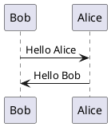
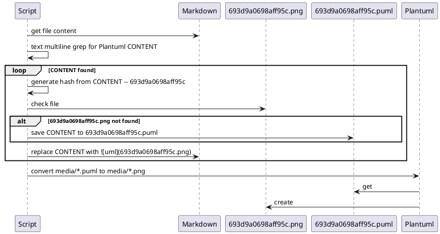

# uml 1

```plantuml
@startuml
Bob   ->  Alice : Hello Alice
Alice ->  Bob   : Hello Bob
@enduml
```

# uml 2

```plantuml
@startuml
Script -> Markdown: get file content
Script  -> Script : text multiline grep for Plantuml CONTENT
loop CONTENT found
    Script  -> Script : generate hash from CONTENT -- 693d9a0698aff95c
    Script  -> 693d9a0698aff95c.png: check file
    alt 693d9a0698aff95c.png not found
        Script  -> 693d9a0698aff95c.puml: save CONTENT to 693d9a0698aff95c.puml
    end
    Script  -> Markdown: replace CONTENT with ![uml](693d9a0698aff95c.png)
end
Script  -> Plantuml: convert media/*.puml to media/*.png
Plantuml -> 693d9a0698aff95c.puml: get
Plantuml -> 693d9a0698aff95c.png: create
@enduml
```

more text text ...
